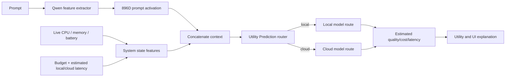
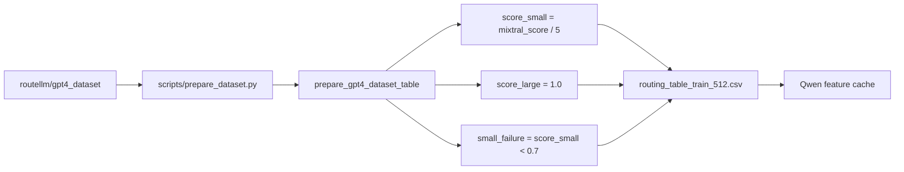
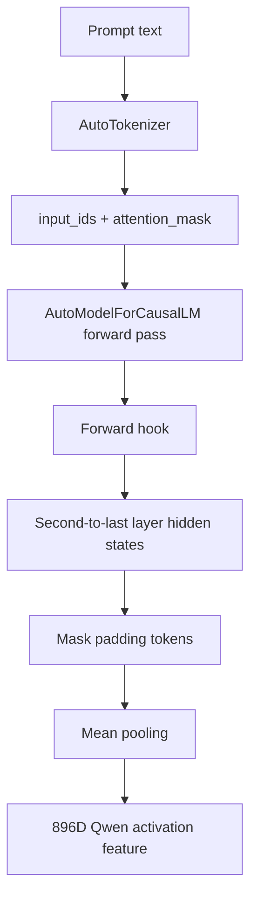
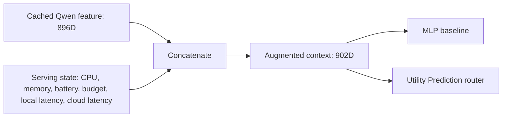
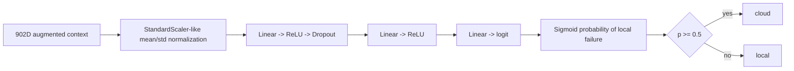
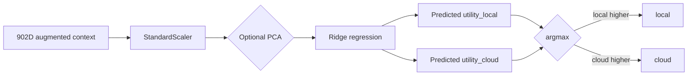
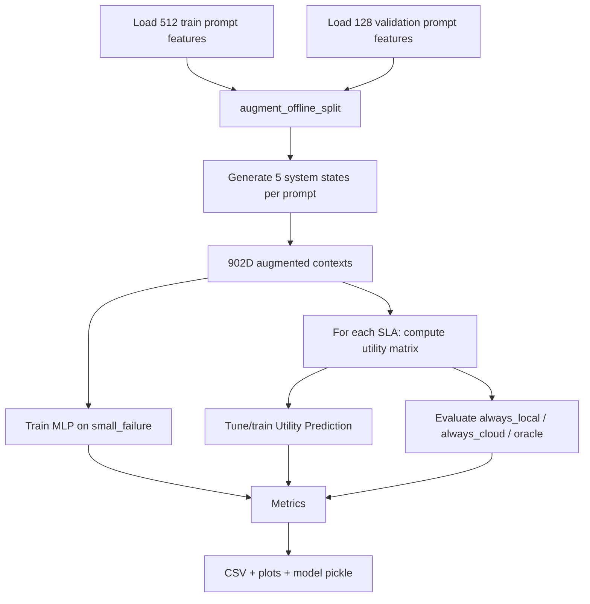
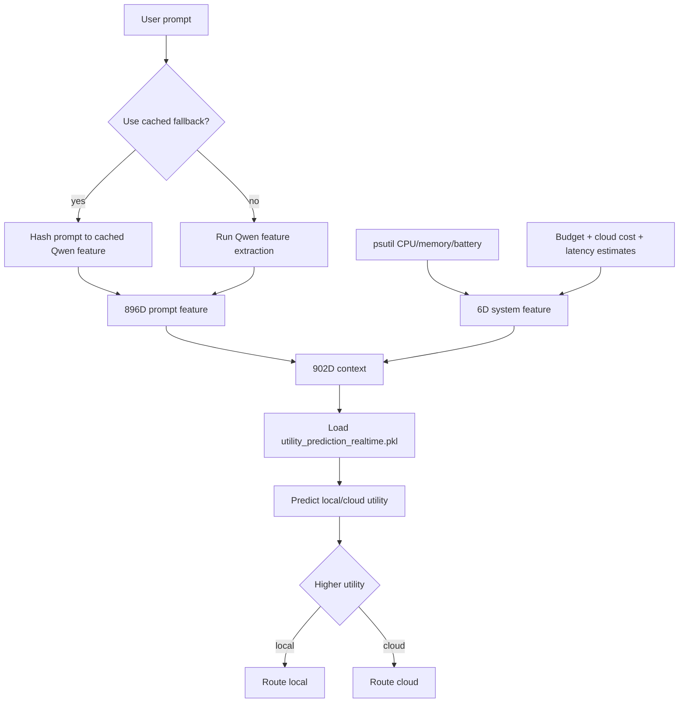

# Adaptive LLM Routing Gateway: Final Technical Walkthrough

This document explains the current simplified project scope end to end. It is intended as a memory rebuild for final report writing, presentation prep, and code walkthroughs.

The final project is now aligned around a **real-time LLM routing gateway**:

- **Main offline comparison:** MLP classifier baseline vs Utility Prediction router.
- **Final selected router:** Utility Prediction.
- **Demo:** Streamlit app using Utility Prediction with live system/budget/latency features.

---

## 1. Project Overview

### Problem

LLM applications often have two broad serving options:

- a **local route**: cheap, private, and fast-ish, but lower quality on hard prompts;
- a **cloud route**: higher quality, but more expensive and usually slower.

Always using the cloud model wastes money and latency. Always using the local model can fail on hard prompts. The project builds a router that decides, for each prompt and current serving state, whether to route locally or to the cloud.

This is an **AI infrastructure / LLM serving** problem. The model is not just answering prompts; the infrastructure layer is deciding how to allocate inference work across backends under cost and latency constraints.

### Central Research Question

> Can a utility-aware router make better real-time local-vs-cloud routing decisions than a supervised failure classifier when the objective includes quality, cost, latency, budget, and system state?

### Final Formulation

```text
context = concat(Qwen activation features, system/budget/latency features)
action = local route or cloud route
objective = maximize utility = quality - alpha * cost - beta * latency
```

### Main Algorithms

| Algorithm | Role | Main idea |
|---|---|---|
| MLP classifier | Baseline | Predict whether the local/small model fails |
| Utility Prediction | Final selected model | Predict local utility and cloud utility, then choose higher utility |

### Overall Architecture



---

## 2. Dataset Preparation

### Raw Dataset

The project uses the HuggingFace dataset:

```text
routellm/gpt4_dataset
```

Observed raw fields:

- `prompt`: user query/task;
- `source`: original source dataset;
- `gpt4_response`: response from GPT-4;
- `mixtral_response`: response from Mixtral;
- `mixtral_score`: GPT-4 judge score for Mixtral's response.

Interpretation:

- Mixtral is used as the **small/local quality proxy**.
- GPT-4 is used as the **large/cloud quality proxy**.
- `mixtral_score` is treated as a GPT-4 judge quality score for the small model.

### Routing Table Conversion

The raw dataset is converted into a routing table:

```text
score_small = mixtral_score / 5
score_large = 1.0
small_failure = score_small < 0.7
latency_small = 0.2
latency_large = 3.0
```

For the final real-time aligned experiment, the old `latency_small` and `latency_large` columns are less important because each prompt is augmented with serving-state latency estimates:

```text
estimated_local_latency
estimated_cloud_latency
```

### Concrete Example

Raw example:

| field | value |
|---|---|
| prompt | `Write C++ code that calculates n digits of pi.` |
| mixtral_score | `3` |
| gpt4_response | Stronger reference answer |
| mixtral_response | Small-model proxy answer |

Converted row:

| field | value |
|---|---:|
| score_small | `3 / 5 = 0.6` |
| score_large | `1.0` |
| small_failure | `1` |
| latency_small | `0.2` |
| latency_large | `3.0` |

### Dataset Pipeline



### Code Locations

| Path | Key class/function | Input | Output | Role |
|---|---|---|---|---|
| `scripts/prepare_dataset.py` | `main` | HuggingFace split | CSV table | Downloads and normalizes dataset |
| `src/llm_router/dataset.py` | `prepare_gpt4_dataset_table` | HF dataset object | pandas DataFrame | Converts raw fields to routing fields |
| `src/llm_router/dataset.py` | `load_routing_table` | CSV/Parquet | DataFrame | Loads prepared tables |

Important snippet:

```python
table["score_small"] = pd.to_numeric(df["mixtral_score"], errors="coerce") / 5.0
table["score_large"] = 1.0
table["small_failure"] = (table["score_small"] < small_failure_threshold).astype(int)
```

Current core artifacts:

```text
data/processed/routing_table_train_512.csv
data/processed/routing_table_validation_128.csv
data/processed/activation_features_train_512.npz
data/processed/activation_features_validation_128.npz
```

---

## 3. Qwen Feature Extraction

### Why Not Feed Raw Text To The Router?

The routers need fixed-size numeric vectors. Raw prompts are variable-length text. The project uses Qwen hidden activations as prompt features because those activations encode the prompt after a real language model reads it.

### Feature Extractor

Model:

```text
Qwen/Qwen2.5-0.5B-Instruct
```

Process:

1. tokenize prompt;
2. run Qwen forward pass only;
3. do not generate tokens;
4. capture second-to-last decoder layer with a PyTorch forward hook;
5. mean-pool hidden states over non-padding tokens;
6. return an 896-dimensional vector.

### Qwen Feature Diagram



### Code Locations

| Path | Key class/function | Input | Output | Role |
|---|---|---|---|---|
| `src/llm_router/feature_extractor.py` | `MechanisticFeatureExtractor` | prompt(s) | activation vector(s) | Local Qwen encoder |
| `scripts/cache_activation_features.py` | `main` | routing CSV | `.npz` cache | Batch feature caching |

Important snippet:

```python
handle = layers[self.layer_index].register_forward_hook(capture_hidden_states)

with torch.inference_mode():
    self.model(**inputs, use_cache=False)
```

Mean pooling:

```python
mask = attention_mask.to(device=hidden_states.device, dtype=hidden_states.dtype).unsqueeze(-1)
masked_hidden_states = hidden_states * mask
token_counts = mask.sum(dim=1).clamp(min=1)
return masked_hidden_states.sum(dim=1) / token_counts
```

### Limitation

Features come from Qwen, while labels/scores come from Mixtral/GPT-4 evaluations. This is a proxy representation and creates a possible mismatch: Qwen's internal representation may not perfectly encode Mixtral's failure patterns.

---

## 4. Real-Time Serving Scenario Augmentation

The final scope adds real-time serving state to the prompt feature.

For each cached prompt feature, the offline experiment generates 5 serving scenarios by default. Each scenario includes:

```text
cpu_percent normalized 0-1
memory_percent normalized 0-1
battery_percent normalized 0-1
budget_remaining normalized 0-1
estimated_local_latency
estimated_cloud_latency
```

The final context is:

```text
context = concat(896D Qwen feature, 6D system state)
context_dim = 902
```

Current real-time aligned experiment:

```text
train_contexts = (2560, 902)
validation_contexts = (640, 902)
```

### Serving Augmentation Diagram



### Code Locations

| Path | Key class/function | Input | Output | Role |
|---|---|---|---|---|
| `src/llm_router/realtime.py` | `generate_serving_states` | number of prompts | system state matrix | Simulates serving conditions |
| `src/llm_router/realtime.py` | `augment_offline_split` | cached split | augmented contexts | Expands each prompt into scenarios |
| `src/llm_router/realtime.py` | `make_system_features` | live system values | 6D vector | Used by Streamlit demo |

Important snippet:

```python
contexts = np.concatenate([qwen_features, system_features], axis=1).astype(np.float32)
```

---

## 5. Routing Problem Formulation

### State / Context

```text
x = [qwen_activation, system_state] in R^902
```

### Actions

```text
action 0 = local
action 1 = cloud
```

### Objective

```text
utility = quality - alpha * cost - beta * latency
```

### Real-Time Utility Terms

```text
quality_local = score_small
quality_cloud = score_large
cost_local = 0
cost_cloud = estimated_remote_cost_per_request / max(budget_remaining, 0.05)
latency_local = estimated_local_latency
latency_cloud = estimated_cloud_latency
```

Therefore:

```text
utility_local = score_small - beta * estimated_local_latency
utility_cloud = score_large - alpha * cost_cloud - beta * estimated_cloud_latency
```

### Oracle Action

```text
oracle = argmax(utility_local, utility_cloud)
```

The oracle is not deployable because it uses offline ground-truth scores. It is used for evaluation.

### Code Locations

| Path | Key function | Role |
|---|---|---|
| `src/llm_router/realtime.py` | `realtime_utility_matrix` | Computes local/cloud utility columns |
| `src/llm_router/realtime.py` | `realtime_oracle_actions` | Computes oracle action |
| `src/llm_router/realtime.py` | `realtime_route_metrics` | Computes final metrics |

Important snippet:

```python
cost_cloud = split.remote_cost_per_request / np.maximum(budget_remaining, 0.05)

utility_local = split.score_small - sla.beta_latency * local_latency
utility_cloud = split.score_large - sla.alpha_cost * cost_cloud - sla.beta_latency * cloud_latency
```

---

## 6. SLA Modes

SLA modes are defined in:

```text
src/llm_router/utilities.py
```

| SLA mode | alpha cost | beta latency | Intuition |
|---|---:|---:|---|
| `quality_first` | 0.05 | 0.02 | Cloud is often worth it |
| `balanced` | 0.20 | 0.05 | Cloud only if quality gain justifies it |
| `cost_sensitive` | 0.45 | 0.08 | Strong pressure to stay local |

Example with:

```text
score_small = 0.8
score_cloud = 1.0
budget_remaining = 0.5
cloud_cost_per_request = 0.05
cost_cloud = 0.05 / 0.5 = 0.1
latency_local = 0.7
latency_cloud = 1.4
```

Balanced:

```text
utility_local = 0.8 - 0.05*0.7 = 0.765
utility_cloud = 1.0 - 0.20*0.1 - 0.05*1.4 = 0.910
oracle: cloud
```

Cost-sensitive:

```text
utility_local = 0.8 - 0.08*0.7 = 0.744
utility_cloud = 1.0 - 0.45*0.1 - 0.08*1.4 = 0.843
oracle: cloud
```

If budget drops to `0.05`, cloud cost becomes `1.0`, and the same cloud route becomes much less attractive.

---

## 7. Fixed Baselines

The fixed baselines still appear in final metrics:

- `always_local`
- `always_cloud`
- `oracle`

Why they matter:

- `always_local` shows cheapest behavior.
- `always_cloud` shows maximum cloud usage.
- `oracle` shows the upper bound under the utility design.

The older helper functions are in:

```text
src/llm_router/baselines.py
```

In the real-time aligned script, local/cloud arrays are created directly because the augmented split uses `contexts` rather than the old `features` field.

---

## 8. MLP Classifier Baseline

MLP means **Multi-Layer Perceptron**.

### Formulation

Input:

```text
902D augmented context
```

Target:

```text
small_failure = score_small < 0.7
```

Decision:

```text
if predicted failure probability >= 0.5:
    route cloud
else:
    route local
```

### MLP Diagram



### Code

Location:

```text
src/llm_router/mlp_router.py
```

Key function:

```text
train_mlp_router
```

Architecture snippet:

```python
model = nn.Sequential(
    nn.Linear(x_train.shape[1], hidden_dim),
    nn.ReLU(),
    nn.Dropout(p=0.10),
    nn.Linear(hidden_dim, hidden_dim // 2),
    nn.ReLU(),
    nn.Linear(hidden_dim // 2, 1),
)
```

Loss:

```python
criterion = nn.BCEWithLogitsLoss(pos_weight=pos_weight)
```

Optimizer:

```python
optimizer = torch.optim.AdamW(...)
```

### Limitation

The MLP predicts failure, not utility. This means it can route cloud even when cost/budget/latency make cloud a bad utility choice, or route local when cloud would have been worth it under quality-first settings.

---

## 9. Utility Prediction Routers

The final project now frames routing as utility prediction. The Ridge Utility Router is the linear baseline, and the Neural Utility Router is the stronger nonlinear model used for the main final comparison.

### Formulation

Input:

```text
902D augmented context + SLA weights alpha/beta
```

Targets:

```text
utility_local
utility_cloud
```

Both models choose the route with higher predicted utility. The Neural Utility Router is implemented in `src/llm_router/neural_utility.py` and evaluated by `scripts/evaluate_neural_utility_router.py`.

Decision:

```text
route = argmax(predicted_utility_local, predicted_utility_cloud)
```

### Why It Matches The Final Goal

The final objective is utility, not failure detection. Utility Prediction directly learns the utility surface for each SLA mode, so it can incorporate quality, budget pressure, effective cloud cost, and latency.

### Utility Prediction Diagram



### Code

General utility-prediction helper:

```text
src/llm_router/utility_prediction.py::train_utility_prediction_router
```

Real-time aligned training path:

```text
scripts/evaluate_realtime_aligned.py::train_utility_prediction_model_config
```

Current model pipeline:

```python
steps = [StandardScaler()]
if pca_dim is not None:
    steps.append(PCA(n_components=pca_dim, random_state=184))
steps.append(Ridge(alpha=ridge_alpha))
```

The script tunes:

```text
PCA dims: no_pca, 16, 32, 64, 128
Ridge alpha: 0.1, 1.0, 10.0, 100.0, 1000.0
```

This tuning is selected on the 128-prompt validation split after augmentation, so it must be reported as validation-tuned.

### Saved Model Artifact

```text
models/utility_prediction_realtime.pkl
```

This artifact stores a per-SLA utility-prediction model and metadata such as context dimension, Qwen dimension, and selected PCA/ridge settings.

---

## 10. Offline Experiment Pipeline

Main script:

```text
scripts/evaluate_realtime_aligned.py
```

Flow:



Current run:

```text
train_contexts: (2560, 902)
validation_contexts: (640, 902)
```

Generated artifacts:

```text
results/realtime_aligned_metrics.csv
results/realtime_utility_prediction_ablation.csv
results/plots/realtime_aligned_policy_comparison.png
results/plots/realtime_aligned_cost_latency_tradeoff.png
results/plots/realtime_aligned_cloud_rate.png
models/utility_prediction_realtime.pkl
```

Command:

```bash
python scripts/evaluate_realtime_aligned.py
```

---

## 11. Evaluation Metrics

The real-time aligned metrics include:

| Metric | Meaning |
|---|---|
| `avg_utility` | Mean selected utility; primary metric |
| `avg_quality` | Average quality of selected route |
| `avg_cost` | Average effective cloud cost paid by selected policy |
| `avg_latency` | Average selected-route latency |
| `cloud_route_rate` | Fraction routed to cloud |
| `routing_accuracy_vs_oracle` | Fraction matching oracle utility action |
| `budget_penalty` | Same practical meaning as average effective selected cloud cost |
| `avg_effective_cloud_cost` | Average possible cloud cost across scenarios |
| `precision_cloud_vs_oracle` | Among cloud routes, how often oracle also chose cloud |
| `recall_cloud_vs_oracle` | Among oracle-cloud cases, how many policy caught |
| `f1_cloud_vs_oracle` | Cloud-route F1 against oracle |

ML-style metrics:

- precision,
- recall,
- F1,
- confusion matrix counts.

AI-infrastructure metrics:

- utility,
- cost,
- latency,
- cloud route rate,
- budget penalty.

`avg_utility` is the primary metric because the goal is deployment utility under SLA constraints.

---

## 13. Current Real-Time Aligned Results

Current metrics file:

```text
results/realtime_aligned_metrics.csv
```

Summary:

| SLA | Policy | Avg utility | Avg quality | Avg cost | Avg latency | Cloud rate | Routing acc vs oracle |
|---|---|---:|---:|---:|---:|---:|---:|
| quality_first | always_local | 0.879 | 0.894 | 0.000 | 0.723 | 0.000 | 0.719 |
| quality_first | always_cloud | 0.965 | 1.000 | 0.139 | 1.418 | 1.000 | 0.281 |
| quality_first | MLP | 0.905 | 0.922 | 0.017 | 0.840 | 0.164 | 0.667 |
| quality_first | Utility Prediction | 0.965 | 1.000 | 0.137 | 1.413 | 0.992 | 0.289 |
| quality_first | oracle | 0.980 | 1.000 | 0.036 | 0.913 | 0.281 | 1.000 |
| balanced | always_local | 0.858 | 0.894 | 0.000 | 0.723 | 0.000 | 0.720 |
| balanced | always_cloud | 0.901 | 1.000 | 0.139 | 1.418 | 1.000 | 0.280 |
| balanced | MLP | 0.877 | 0.922 | 0.017 | 0.840 | 0.164 | 0.669 |
| balanced | Utility Prediction | 0.901 | 0.977 | 0.088 | 1.169 | 0.656 | 0.480 |
| balanced | oracle | 0.947 | 1.000 | 0.035 | 0.911 | 0.280 | 1.000 |
| cost_sensitive | always_local | 0.836 | 0.894 | 0.000 | 0.723 | 0.000 | 0.728 |
| cost_sensitive | always_cloud | 0.824 | 1.000 | 0.139 | 1.418 | 1.000 | 0.272 |
| cost_sensitive | MLP | 0.847 | 0.922 | 0.017 | 0.840 | 0.164 | 0.677 |
| cost_sensitive | Utility Prediction | 0.855 | 0.966 | 0.059 | 1.049 | 0.481 | 0.566 |
| cost_sensitive | oracle | 0.911 | 0.998 | 0.032 | 0.904 | 0.272 | 1.000 |

### Interpretation

Utility Prediction beats MLP in all three SLA modes by average utility:

- `quality_first`: Utility Prediction `0.965` vs MLP `0.905`
- `balanced`: Utility Prediction `0.901` vs MLP `0.877`
- `cost_sensitive`: Utility Prediction `0.855` vs MLP `0.847`

The reason is not that Utility Prediction is a better failure classifier. It is better aligned with the objective. It predicts route utility directly, while MLP predicts only local failure.

In quality-first mode, Utility Prediction routes to cloud almost always, which is reasonable under the current utility weights because cloud quality dominates and cloud cost is not heavily penalized.

In balanced/cost-sensitive modes, Utility Prediction lowers cloud usage relative to always-cloud and improves utility relative to MLP.

---

## 14. Streamlit Demo

Demo file:

```text
app/streamlit_app.py
```

Run:

```bash
streamlit run app/streamlit_app.py
```

### Demo Behavior

The app:

1. takes a prompt;
2. collects live CPU, memory, and battery through `psutil`;
3. lets the user set session budget and estimated cloud cost;
4. tracks remaining budget in `st.session_state`;
5. estimates local/cloud latency;
6. extracts Qwen features or uses cached fallback;
7. concatenates Qwen features with system features;
8. predicts local/cloud utility with the selected SLA model;
9. chooses local or cloud;
10. shows route, predicted utilities, estimated cost, latency, system metrics, and explanation.

### Demo Routing Flow



### Optional Generation

Default:

- route decision only,
- no API call required.

Optional:

- local generation via Ollama if available;
- cloud generation through OpenAI-compatible API only if API key is provided and the user checks the cloud-call box.

The demo intentionally keeps generation optional so routing remains fast and does not depend on API credentials.

### Important Demo Detail

The offline utility-prediction model was trained with default cloud cost:

```text
0.05
```

The demo lets the user change cloud cost. Since cloud cost is not part of the explicit 6D system feature list, the app applies a utility correction to the predicted cloud utility:

```python
adjusted[LARGE] -= sla.alpha_cost * (actual_effective_cost - default_effective_cost)
```

This keeps the demo responsive to user budget/cost settings while preserving the agreed context feature structure.

---

## 15. Limitations

1. **Validation tuning:** Utility Prediction PCA/ridge settings are selected on the validation split. This should be reported honestly.
2. **Small core prompt split:** The current real-time aligned experiment starts from 512 train prompts and 128 validation prompts, then augments serving scenarios.
3. **Synthetic serving states:** CPU/memory/battery/budget/latency are simulated offline, though live values are used in the demo.
4. **Fixed cloud quality:** `score_large = 1.0`; real cloud models can fail.
5. **Simulated cost/latency:** Offline cost and latency are estimated, not measured from real cloud APIs.
6. **Qwen/Mixtral mismatch:** Qwen features are used to predict labels derived from Mixtral/GPT-4 comparisons.
7. **Demo is not production serving:** It is a route-decision demo, with optional local/cloud generation hooks.
8. **No full session-level budget planning:** Budget is tracked greedily per request, not optimized across future requests.

---

## 16. Final Takeaways

The simplified final message:

> LLM routing is not just failure classification. It is real-time utility optimization under quality, cost, latency, budget, and system-state constraints.

MLP is a useful baseline because it predicts local failure from the same context vector. However, it does not directly optimize the deployment objective.

Utility Prediction is the final selected formulation because:

- it uses the same context as the real-time demo;
- it predicts local and cloud utility directly;
- it allows Ridge Regression and Neural Networks to be compared on the same regression and routing metrics;
- the Neural Utility Router outperforms the Ridge Utility Router in the current final utility-prediction experiment;
- it is easier to deploy in a Streamlit gateway and FastAPI service;

The final report should frame the system as a utility-aware LLM routing gateway with an MLP classifier baseline, a Ridge Utility Router baseline, and a Neural Utility Router final model.

---

## 17. Key Files

| File | Role |
|---|---|
| `src/llm_router/realtime.py` | Real-time context augmentation and utility logic |
| `scripts/evaluate_realtime_aligned.py` | Main final offline experiment |
| `models/utility_prediction_realtime.pkl` | Final router model artifact for demo |
| `app/streamlit_app.py` | Real-time Streamlit routing gateway |
| `results/realtime_aligned_metrics.csv` | Final aligned metrics |
| `results/realtime_utility_prediction_ablation.csv` | Utility Prediction tuning results |
| `results/plots/realtime_aligned_policy_comparison.png` | Report-ready utility comparison |
| `results/plots/realtime_aligned_cost_latency_tradeoff.png` | Report-ready cost/latency plot |
| `results/plots/realtime_aligned_cloud_rate.png` | Report-ready cloud route rate plot |
| `src/llm_router/mlp_router.py` | MLP baseline |
| `src/llm_router/utility_prediction.py` | General Utility Prediction helper |
